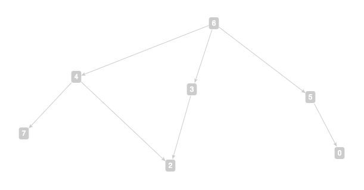

# Basic algorithms for computing graph isomorphisms

To this day, the worst-case complexity for solving the general
[graph isomorphism problem](https://en.wikipedia.org/wiki/Graph_isomorphism_problem)
is not yet known, despite the existence of polynomial-time algorithms
for solving many special cases. In particular, the isomorphism problem
for
[term DAGs](https://chenmoucheng.github.io/43041/graph-theory-representations.html#terms-and-term-dags)
can be solved efficiently, and we are going to implement a simple
algorithm that solves a subclass of it in this experiment.

**Definition.** A
  [*directed walk*](https://en.wikipedia.org/wiki/Path_(graph_theory)#Directed_walk,_trail,_path)
  in a directed graph is a (possibly empty) sequence of edges (e_1,
  e_2, e_3, ...)  such that t(e_(i-1)) = s(e_i) and t(e_i) =
  s(e_(i+1)) whenever defined. A
  [*directed path*](https://en.wikipedia.org/wiki/Path_(graph_theory)#Directed_walk,_trail,_path)
  is a directed walk going through distinct vertices, that is, when
  (s(e_1), t(e_1)=s(e_2), t(e_2)=s(e_3), t(e_3)=s(e_4), ...) is a
  (possibly empty) sequence of distinct vertices.

**Lemma.** In a DAG, every directed walk is a directed path.

**Definition.** A *root* of a directed graph G = (V,E) is a vertex r ∈
  V such that there is a directed path from r to every other vertex v
  ∈ V \ {r}.

**Lemma.** If a DAG has a root, then it has a unique root, in which
  case it is called a *rooted DAG*.

**Lemma.** Any term DAG associated with a term is rooted. Furthermore,
  the root of a term DAG is the
  [least element](https://en.wikipedia.org/wiki/Greatest_and_least_elements)
  under any of its topological sorts.

**Definition.** Recall that in a term DAG, the outgoing edges from any
  vertex are ordered. An *access path* of a vertex v in a *rooted term
  DAG* G = (V,E) is a (possibly empty) sequence of positive integers
  (p_1, p_2, p_3, ...)  such that there is a directed path (e_1, e_2,
  e_3, ...) from the root of G to v, and for i = 1, 2, 3, ..., p_i is
  the position of e_i among the outgoing edges of s(e_i).

**Example.** Let [G](http://arborjs.org/halfviz/#/MTI5MjA) be the
  following rooted term DAG.

```
; h(g(c,x2),f(x2),f(x0))
; 6
3 -> 2
4 -> 7
4 -> 2
5 -> 0
6 -> 4
6 -> 3
6 -> 5
```



Vertex|Access paths
---:|---:
0|(3,1)
2|(1,2),(2,1)
3|(2)
4|(1)
5|(3)
6|()
7|(1,1)

**Exercise.** Come up with a topological sort for G in the above
  example and verify that the root of G is indeed the least element in
  the topological sort that you come up with.

**Lemma.** In a rooted term DAG, distinct vertices cannot have
  identical sets of access paths.

**Theorem.** Let AP_v be the set of all access paths of a vertex v in
  a rooted term DAG. Then for all rooted term DAGs G = (V,E) and G' =
  (V',E'), G and G' are isomorphic if and only if { AP_v : v ∈ V } = {
  AP_v' : v' ∈ V' }.

**Exercise.** Let [G'](http://arborjs.org/halfviz/#/MTI5MjE) be the
following rooted term DAG. Find a graph isomorphism φ from G to G'.

```
; h(g(c,x2),f(x2),f(x0))
; 4
3 -> 0
4 -> 7
4 -> 5
4 -> 3
5 -> 2
7 -> 6
7 -> 2
```

### Homework 3.

Implement the following two functions in the
[sample code](./code/sample.c) and give a few convincing test cases to
show the correctness of your implementation. Feel free to design and
implement your custom, auxiliary datatypes to represent, e.g., access
paths in order to achieve your goals.

```
// Test if a list of vertices represents an isomorphism between two rooted term DAGs
int isanIsomorphism(const ListOfVertices *phi, const Graph *g, const Graph *h);

// An isomorphism between two rooted term DAGs
int isomorphism(ListOfVertices *iso, const Graph *g, const Graph *h);

/*
 * // Sample test vectors:
 * 
 * Graph g, h;
 * ListOfVertices phi;
 * 
 * readGraph(&g, "1\n7\n0\n0\n1 2\n2 7 2\n1 1\n3 4 3 5\n0\n");
 * readGraph(&h, "1\n7\n0\n0\n0\n3 7 6 5\n1 1\n1 2\n2 3 2\n");
 * 
 * isomorphism(&phi, &g, &h);     // 1
 * showListOfVertices(&phi);      // 7 1 2 6 7 5 4 3
 * isanIsomorphism(&phi, &g, &h); // 1
 * 
 * freeGraph(&g);
 * freeGraph(&h);
 * freeListOfVertices(&phi);
 */

```
