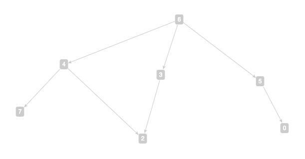
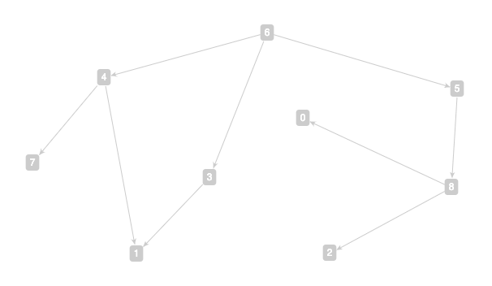
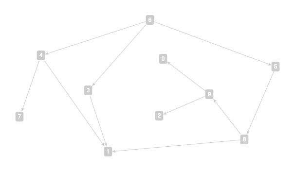

# [2-3 データ構造とアルゴリズム](./README.md)

## Graph theory

The main reference here is Chapter 6 and 7 of the lecture notes on
『
[アルゴリズムとデータ構造](https://eduweb.sta.kanazawa-u.ac.jp//portal/Public/Syllabus/SyllabusSearchStart.aspx?lct_year=2019&fac_cd=52&lct_no=43002&je_cd=1)
』 by 松林昭先生, which we shall refer to as
*the lecture notes* in this handout. We briefly review some of the
most important definitions and facts that will be useful to us.

**Definition.** A
  [*set*](https://en.wikipedia.org/wiki/Set_(mathematics)) is a
  collection of distinct *elements*. We write *x ∈ X* if x is an
  element of the set X.

**Definition.** A
  [*function*](https://en.wikipedia.org/wiki/Function_(mathematics)) f
  from its *domain* X to its *codomain* Y associates exactly one
  element f(x) ∈ Y to each and every element x ∈ X. A function f from
  set X to set Y is often denoted as *f: X→Y*.

**Definition.** Given functions f: X→Y and g: Y→Z, the
  [*composition*](https://en.wikipedia.org/wiki/Function_composition)
  of f and g is a function g ⚬ f: X→Z defined by (g ⚬ f)(x) = g(f(x))
  for all x ∈ X.

**Definition.** For a set X, there is a unique
  [*identity function*](https://en.wikipedia.org/wiki/Identity_function)
  1: X→X on X that sends every x ∈ X to itself.

**Definition.** A function f: X→Y is
  [*surjective*](https://en.wikipedia.org/wiki/Surjective_function) if
  for every y ∈ Y, there is at least one x ∈ X such that y = f(x). It
  is [*injective*](https://en.wikipedia.org/wiki/Injective_function)
  if f(x) = f(x') implies that x = x', or equivalently, x ≠ x' implies
  f(x) ≠ f(x').

**Definition.** A function f: X→Y is
  [*bijective*](https://en.wikipedia.org/wiki/Bijection) if it is both
  surjective and injective, in which case it has an
  [*inverse*](https://en.wikipedia.org/wiki/Inverse_function) g: Y→X
  such that g ⚬ f = 1 and f ⚬ g = 1.

**Definition.** A
  [graph](https://en.wikipedia.org/wiki/Graph_(discrete_mathematics))
  G is an
  [unordered pair](https://en.wikipedia.org/wiki/Unordered_pair) (V,E)
  of sets, where each v ∈ V is a *vertex* of G, and each e ∈ E, an
  *edge* of G. An edge *connects* two (not necessarily distinct)
  vertices.

**Definition.** A
  [*directed graph*](https://en.wikipedia.org/wiki/Directed_graph) is
  graph G = (V,E) such that each edge e ∈ E is an
  [ordered pair](https://en.wikipedia.org/wiki/Ordered_pair) (u,v) for
  some u,v ∈ V, i.e., there are functions s,t: E→V such that for each
  edge (u,v) ∈ E, s(u,v) = u and t(u,v) = v.

In other words, we tend to think of an edge e ∈ E of a directed graph
G = (V,E) as an arrow, pointing from its *source* s(e) to its *target*
t(e).

**Example** (from the lecture notes). Let G = (V,E) for V =
  {a,b,c,d,e,f,g,h} and E = {(a,b), (a,c), (a,d), (b,d), (c,d), (d,e),
  (c,f), (f,g), (f,h), (g,h)}. In the lecture notes, there is a
  visualization of G as an undirected graph. You can use
  [http://arborjs.org/halfviz](http://arborjs.org/halfviz/)
  [to visualize G](http://arborjs.org/halfviz/#/MTI5MTg) as a directed
  graph.

```
a -> b
a -> c
a -> d
b -> d
c -> d
d -> e
c -> f
f -> g
f -> h
g -> h
```

The visualization produced by
[http://arborjs.org/halfviz](http://arborjs.org/halfviz/) is
interactive. For example, you can drag the vertices to make it look
like the (undirected) graph in the lecture notes. As you can see, the
edges in a directed graph are usually visualized using arrows, whereas
in an undirected graph, lines.

So far we have been discussing *simple graphs*, which are graphs whose
edges are sets; alternatively, G = (V,E) is a simple directed graph if
the function (s,t): E→V×V is injective.  We can generalize the notion
to [*multigraphs*](https://en.wikipedia.org/wiki/Multigraph), namely,
graphs whose edges are
[multisets](https://en.wikipedia.org/wiki/Multiset). For directed
graphs, the function (s,t): E→V×V is no longer required to be
injective, so there can be two edges e ≠ e' but (s(e),t(e)) =
(s(e'),t(e')). In other words, the equality of edges of multigraphs is
not predicated on the equality of their sources and targets, but
rather on some other identities.

In contrast to the lecture notes, we are mainly interested in
multigraphs. Unfortunately,
[http://arborjs.org/halfviz](http://arborjs.org/halfviz/) can only
visualize simple graphs. You can try other (graph) visualization
tools, such as [Cytoscape.js](https://js.cytoscape.org/), to see if
you can visualize multigraphs.

**Definition.** A
  [*topological sort*](https://en.wikipedia.org/wiki/Topological_sorting)
  of a directed graph G = (V,E) is a
  [*linear ordering*](https://en.wikipedia.org/wiki/Total_order) on V
  such that if there is an edge e ∈ E with s(e) = u and t(e) = v, then
  u ≤ v in the ordering.

**Definition.** A
  [*directed acyclic graph (DAG)*](https://en.wikipedia.org/wiki/Directed_acyclic_graph)
  is a directed graph that has a topological sort.

**Remark.** It follows immediately that a DAG does not have any
  [*directed cycles*](https://en.wikipedia.org/wiki/Cycle_(graph_theory)#Directed_circuit,_cycle),
  so we could also define DAGs to be directed graphs without any
  directed cycles. These two definitions are equivalent.

**Example.** There exists a topological sort for the directed graph G
  in the above example, e.g., a ≤ b ≤ c ≤ d ≤ e ≤ f ≤ g ≤
  h. Therefore, G is a DAG.

**Exercise.** Come up with a different topological sort for G and
  visualize it using
  [http://arborjs.org/halfviz](http://arborjs.org/halfviz/).

## Terms and term DAGs

Graphs have numerous applications. In this experiment, we shall
explore a particular application of DAGs to
[*term unification*](https://en.wikipedia.org/wiki/Unification_(computer_science)#Syntactic_unification_of_first-order_terms).

**Definition.** Given a set V of *variable symbols*, a set C of
  *constant symbols*, and sets Fn of *n-ary function symbols* for each
  positive integer n, the set of
  [*(unsorted first-order) terms*](https://en.wikipedia.org/wiki/Term_(logic)#Formal_definition)
  T is recursively defined to be the smallest set such that:

  - every variable symbol is a term: V ⊆ T;

  - every constant symbol is a term: C ⊆ T;

  - from every n terms t1,...,tn ∈ T and every n-ary function symbol f
  ∈ Fn, there is a term f(t1,...,tn) ∈ T.

**Definition.** A *term DAG* is a directed acyclic multigraph whose
  vertices are labeled with variable, constant, or function symbols,
  whose outgoing edges from any vertex are *ordered*, and where the
  outdegree of any vertex labeled with a function symbol f is equal to
  the arity of f.

**Example.** Let V = {x0,x1,x2}, C = {c}, F1 = {f}, F2 = {g}, F3 =
  {h}, F4 = F5 = ... = ∅. Then T = {x0, x1, x2, c, f(x0), f(x1),
  f(x2), f(c), g(x0,x0), g(x0,x1), ..., h(x0,x0,x0), h(x0,x0,x1), ...,
  f(f(x0)), ..., g(f(x0),h(x1,x2,f(c))), ...}. You can download and
  run the program
  [`term-graph.exe`](https://media.githubusercontent.com/media/chenmoucheng/chenmoucheng.github.io/master/43041/code/term-graph.exe)
  in [`cmd.exe`](https://ja.wikipedia.org/wiki/Cmd.exe); every time it
  will output a random term (of an appropriate size) from T, along
  with its term DAG. **Update:** Now you can also access the program
  via its
  [web interface](https://term-graph-iedy2lhg3a-an.a.run.app/).

Let us take a closer look at the following
[example output](https://term-graph-iedy2lhg3a-an.a.run.app/?t=h%28g%28c%2Cx2%29%2Cf%28x2%29%2Cf%28x0%29%29)
and its [visualization](http://arborjs.org/halfviz/#/MTI5MjA).

```
; h(g(c,x2),f(x2),f(x0))
; 6
3 -> 2
4 -> 7
4 -> 2
5 -> 0
6 -> 4
6 -> 3
6 -> 5
```

First, let us try to recover the missing vertex labeling in the term
DAG, which is easy in such a toy example. For example, we observe that
vertex 6 should be labeled with the function symbol h, as it is the
only vertex with outdegree 3. Following the same line of reasoning,
vertex 4 should be labeled with g. Now, when it comes to the other
two outgoing paths 6→3→2 and 6→5→0, we know that both 3 and 5 should
be labeled with f, but it is unclear whether we should label 2 with x0
or x2 (and vice versa for vertex 0). We have a similarly ambiguous
situation when we try to label vertices 7 and 2 if we only look at the
outgoing edges 4→7 and 4→2 from their common source vertex. In this
example, fortunately, we have an additional piece of information that
the subgraphs { 4→7, 4→2 } and { 3→2 } share a common vertex 2, which
must correspond to the fact that the subterms `g(c,x2)` and `f(x2)`
also share a common subterm `x2`.  We can thus complete labeling all
the vertices as follows.

Vertex|0|2|3|4|5|6|7
:---|---:|---:|---:|---:|---:|---:|---:
Symbol|`x0`|`x2`|`f`|`g`|`f`|`h`|`c`

We can now
[visualize this 7-vertex term DAG](http://arborjs.org/halfviz/#/MTI5MTk),
again using [http://arborjs.org/halfviz](http://arborjs.org/halfviz/):

```
3"f" -> 2"x2"
4"g" -> 7"c"
4"g" -> 2"x2"
5"f" -> 0"x0"
6"h" -> 4"g"
6"h" -> 3"f"
6"h" -> 5"f"
```

We conclude this (rather lengthy) example by two important
observations.  First, we note that term DAGs are by no means unique;
sometimes a term can have two or more term DAGs. For example, you can
verify that the following term DAG *with 8 vertices* also corresponds
to the same term `h(g(c,x2),f(x2),f(x0))`:

```
3"f" -> 1"x2"
4"g" -> 7"c"
4"g" -> 2"x2"
5"f" -> 0"x0"
6"h" -> 4"g"
6"h" -> 3"f"
6"h" -> 5"f"
```

Last but not least, the ambiguity can be eliminated altogether if the
outgoing edges from any vertex are indeed *ordered*, as the
definition of term DAGs prescribes. However, this means that the
(outgoing) edges would be a *list*, rather than a multiset.

## Graph representations

Three representations of graphs are introduced in the lecture notes,
namely, *adjacency matrix*, *incidence matrix*, and *adjacency list*.

**Example.** An adjacency matrix for the last term DAG is:

```
0 0 0 0 0 0 0 0
0 0 0 0 0 0 0 0
0 0 0 0 0 0 0 0
0 1 0 0 0 0 0 0
0 0 1 0 0 0 0 1
1 0 0 0 0 0 0 0
0 0 0 1 1 1 0 0
0 0 0 0 0 0 0 0
```

If we forget about the directions of the edges, then an incidence
matrix for the same term DAG (when viewed as an undirected graph) is:

```
0 0 0 1 0 0 0
1 0 0 0 0 0 0
0 0 1 0 0 0 0
1 0 0 0 0 1 0
0 1 1 0 1 0 0
0 0 0 1 0 0 1
0 0 0 0 1 1 1
0 1 0 0 0 0 0
```

Since we are mainly interested in term DAGs, in which outgoing edges
are ordered, we shall focus on adjacency list representations, e.g.,
for the same term DAG:

```
(0,[])
(1,[])
(2,[])
(3,[1])
(4,[7,2])
(5,[0])
(6,[4,3,5])
(7,[])
```

**Definition.** A
  [*graph homomorphism*](https://en.wikipedia.org/wiki/Graph_homomorphism#Definitions)
  φ from a graph G = (V,E) to G' = (V',E') is a function from V to V'
  that *preserves* the graph structure of G; that is, for any edge e =
  (s,t) of G, (φ(s),φ(t)) is an edge of G'. Furthermore, a graph
  homomorphism is a
  [*graph isomorphism*](https://en.wikipedia.org/wiki/Graph_isomorphism)
  when it is bijective as a function between the vertices of the two
  graph, in which case the two graphs are *isomorphic* to each other.

Given a term, the `term-graph.exe` program can also generate a random,
isomorphic term DAG:

```
C:¥> term-graph
; h(g(c,x2),f(x2),f(x0))
; 6
3 -> 2
4 -> 7
4 -> 2
5 -> 0
6 -> 4
6 -> 3
6 -> 5
C:¥> term-graph 'h(g(c,x2),f(x2),f(x0))'
; 4
4 -> 7
4 -> 6
4 -> 5
5 -> 0
6 -> 2
7 -> 3
7 -> 2
```

It is easy to verify that these two graphs are isomorphic by the
following vertex function φ:

v|0|2|3|4|5|6|7
---:|---:|---:|---:|---:|---:|---:|---:
φ(v)|0|2|6|7|5|4|3

Now we can apply φ to every vertex in the adjacency-list
representation of the term DAG in our running example and arrive at
the representation of the other, isomorphic term DAG:

```
(0,[])
(2,[])
(3,[])
(4,[7,6,5])
(5,[0])
(6,[2])
(7,[3,2])
```

**Exercise.** The
  [web version](https://term-graph-iedy2lhg3a-an.a.run.app/) of the
  `term-graph.exe` program can also generate a random term whose term
  DAG has at least certain number of vertices and edges. Run it a few
  times, generate a pair of larger, isomorphic term DAGs, and compute
  the isomorphism between them. Visualize both term DAGs using
  [http://arborjs.org/halfviz](http://arborjs.org/halfviz/) and
  convince yourself that isomorphic graphs are indeed "the same".

## Basic data structures

To represent, e.g., graphs with a custom datatype in C, we typically
use `typedef` to introduce our new datatype, along with a customary
set of functional and managerial routines for manipulating instances
of the new datatype. For example, we may need to test whether two
instances of the new datatype are *equal*: the C programming language
only supports equality on its primitive datatypes, so for more
complicated, derived datatypes such as `struct`, we would need to
implement our own equality tests. For datatypes whose storage size
cannot be determined at compile time, we would also need dynamic
memory management for creating, copying, as well as destroying the
instances. Last but not least, we may also want to provide
input/output functionalities for our new datatypes so that we can work
and debug with them more easily.

**Example.**
```
typedef ... MyType;

int isEqMyType(const MyType *x, const MyType *y);   // x == y?
void copyMyType(MyType *x, const MyType *y);        // x <- y
const char *readMyType(MyType *x, const char* str); // x <- str
void showMyType(const MyType *x);                   // IO <- x
void freeMyType(MyType *x);                         // delete x

// example uses

MyType x, y;

readMyType(&x, input_string);
showMyType(&x); // should look the same as input_string
.
.
.
copyMyType(&y, &x);
assert(isEqMyType(&x, &y));
.
.
.
freeMyType(&x); 
freeMyType(&y); 

```

## A more detailed example

Let us take a closer look at the following
[sample code](./code/sample.c). In this example, we have defined
custom datatypes for vertices and edges, as well as lists of vertices
and edges. Per our discussion above, we need dynamic memory management
for lists but not for vertices and edges, as their storage sizes are
known at compile time. With these datatypes, we can now define our
`Graph` datatype using the adjacency list representation:

```
typedef struct {
    Vertex min,max;
    ListOfVertices *adj;
} Graph;

ListOfVertices *adj(const Graph *g, Vertex v)
{
    return g->adj + (v - g->min);
}
```

Here we assume that our vertices are numbered contiguously from `min`
to `max`, and `adj(&g, v)` gives us the list of adjacent vertices of a
vertex `v` connected by its outgoing edges in a graph `g`. We note
that the two arguments are passed to `adj` differently: `Graph g` is
passed by *reference*, whereas `Vertex v`, by *value*. In C
programming, it is customary to pass instances of primitive datatypes
by value and instances of more complicated, derived datatypes by
reference, as is the case in this example.

### Homework 1.

Implement the following five functions for handling lists of edges and
give a few convincing test cases to show the correctness of your
implementation.

```
int isEqListOfEdges(const ListOfEdges *es, const ListOfEdges *fs); // test if *es == *fs
void copyListOfEdges(ListOfEdges *es, const ListOfEdges *fs);      // copy fs to es
int isNullListOfEdges(const ListOfEdges *es);                      // test if *es == []
void showListOfEdges(const ListOfEdges *es);                       // print es to stdout
void freeListOfEdges(ListOfEdges *es);                             // free the memory used by es

/*
 * // Sample test vectors:
 * 
 * ListOfEdges es, fs;
 * 
 * readListOfEdges(&es, "2\n0 -> 1\n1 -> 2\n");
 * isNullListOfEdges(&es);    // 0
 * copyListOfEdges(&fs, &es);
 * isEqListOfEdges(&es, &fs); // 1
 * showListOfEdges(&fs);
 * // 2
 * // 0 -> 1
 * // 1 -> 2
 * freeListOfEdges(&es);
 * freeListOfEdges(&fs);
 */

```

## Topological sorts of a directed graph, revisited

 We recall that a topological sort of a directed graph G = (V,E) is a
linear ordering on V such that for every edge e ∈ E with s(e) = u and
t(e) = v, u ≤ v in the ordering. Here we give a common way for
computing a topological sort of a directed graph. For that, we will
need the following definition.

**Definition.** The *indegree* of a vertex v ∈ V in a directed
  multigraph G = (V,E) is the number of edges going into v, i.e., |{ e
  ∈ E : t(e) = v }|. Similarly, the *outdegree* of v is the number of
  edges going out from v, i.e., |{ e ∈ E : s(e) = v }|.

**Algorithm ([Kahn, 1962](https://en.wikipedia.org/wiki/Topological_sorting#Kahn's_algorithm)).**

```
Input: Graph G = (V,E)
emptyListOfVertices(&L);
ListOfVertices S ← [ Vertex v | v ← vertices(&G) && indegree(&G, v) == 0 ];
while (!isNullListOfVertices(&S)) {
    Vertex u ← removeAtHeadListOfVertices(&S);
    appendListOfVertices(&L, u);
    foreach [ Vertex v | (u,v) ∈ E ] {
        G ← (V, E \ {(u,v)});
        if (indegree(&G, v) == 0) appendListOfVertices(&S, v);
    }
    G ← (V \ {u}, E);
}
return isNullListOfEdges(&E);
Output: ListOfVertices L (when E = ∅)
```

To prove the correctness of Kahn's algorithm, we need to show that it
terminates in a finite number of steps (for a finite input `Graph G`),
and the output `L` represents a topological sort of the input `Graph
G` when `G` is a DAG and when the algorithm terminates. First, we note
that at each step of the while loop, the number of vertices of `G`
monotonically decreases, so the algorithm must terminate after a
finite number of steps. Next, for every edge `(u,v) ∈ E`, Kahn's
algorithm would never insert `v` before `u` into `L` because a vertex
`v` needs to be in `S` before it can be inserted into `L`, which
happens if and only if its indegree is or becomes 0, at which point
all vertices `u` preceding `v` would have already been inserted into
`L`. Finally, the algorithm terminates when there are no vertices of
indegree 0 in `G`. At this time, `G` is either empty or not a DAG
according to the following two lemmas, whose proofs we leave as an
exercise.

**Lemma.** A (finite) DAG has at least one vertex of indegree 0.

**Lemma.** If we remove one or more vertices/edges from a DAG, then we
  would have another, possibly empty, DAG.

### Homework 2.

Implement the following four functions and give a few convincing test
cases to show the correctness of your implementation. You can use the
[web version](https://term-graph-iedy2lhg3a-an.a.run.app/) of the
`term-graph.exe` program to check whether a list of vertices is a
topological sort of a graph or not.


```
// The edges of a graph
void edges(ListOfEdges *es, const Graph *g);

// The indegree of a vertex of a graph
unsigned int indegree(const Graph *g, Vertex v);

// Test if a list of vertices is a topological sort of a graph
int isaTopSort(const ListOfVertices *vs, const Graph *g);

// A topological sort of a graph
int topSort(ListOfVertices *vs, const Graph *g);

/*
 * // Sample test vectors:
 * 
 * Graph g;
 * ListOfEdges es;
 * ListOfVertices vs;
 * 
 * readGraph(&g, "0\n8\n0\n0\n0\n3 6 7 8\n3 3 1 1\n1 6\n1 1\n2 0 0\n3 5 0 2\n");
 * edges(&es, &g);
 * showListOfEdges(&es);
 * // 13
 * // 3 -> 6
 * // 3 -> 7
 * // 3 -> 8
 * // 4 -> 3
 * // 4 -> 1
 * // 4 -> 1
 * // 5 -> 6
 * // 6 -> 1
 * // 7 -> 0
 * // 7 -> 0
 * // 8 -> 5
 * // 8 -> 0
 * // 8 -> 2
 * indegree(&g, 0);     // 3
 * indegree(&g, 4);     // 0
 * 
 * topSort(&vs, &g);
 * isaTopSort(&vs, &g); // 1
 * 
 * freeGraph(&g);
 * freeListOfEdges(&es);
 * freeListOfVertices(&vs);
 * /

```

## Graph isomorphism algorithms

To this day, the worst-case complexity for solving the general
[graph isomorphism problem](https://en.wikipedia.org/wiki/Graph_isomorphism_problem)
is not yet known, despite the existence of polynomial-time algorithms
for solving many special cases. In particular, the isomorphism problem
for
[term DAGs](https://chenmoucheng.github.io/43041/graph-theory-representations.html#terms-and-term-dags)
can be solved efficiently, and we are going to implement a simple
algorithm that solves a subclass of it in this experiment.

**Definition.** A
  [*directed walk*](https://en.wikipedia.org/wiki/Path_(graph_theory)#Directed_walk,_trail,_path)
  in a directed graph is a (possibly empty) sequence of edges (e_1,
  e_2, e_3, ...)  such that t(e_(i-1)) = s(e_i) and t(e_i) =
  s(e_(i+1)) whenever defined. A
  [*directed path*](https://en.wikipedia.org/wiki/Path_(graph_theory)#Directed_walk,_trail,_path)
  is a directed walk going through distinct vertices, that is, when
  (s(e_1), t(e_1)=s(e_2), t(e_2)=s(e_3), t(e_3)=s(e_4), ...) is a
  (possibly empty) sequence of distinct vertices.

**Lemma.** In a DAG, every directed walk is a directed path.

**Definition.** A *root* of a directed graph G = (V,E) is a vertex r ∈
  V such that there is a directed path from r to every other vertex v
  ∈ V \ {r}.

**Lemma.** If a DAG has a root, then it has a unique root, in which
  case it is called a *rooted DAG*.

**Lemma.** Any term DAG associated with a term is rooted. Furthermore,
  the root of a term DAG is the
  [least element](https://en.wikipedia.org/wiki/Greatest_and_least_elements)
  under any of its topological sorts.

**Definition.** Recall that in a term DAG, the outgoing edges from any
  vertex are ordered. An *access path* of a vertex v in a *rooted term
  DAG* G = (V,E) is a (possibly empty) sequence of positive integers
  (p_1, p_2, p_3, ...)  such that there is a directed path (e_1, e_2,
  e_3, ...) from the root of G to v, and for i = 1, 2, 3, ..., p_i is
  the position of e_i among the outgoing edges of s(e_i).

**Example.** Let [G](http://arborjs.org/halfviz/#/MTI5MjA) be the
  following rooted term DAG.

```
; h(g(c,x2),f(x2),f(x0))
; 6
3 -> 2
4 -> 7
4 -> 2
5 -> 0
6 -> 4
6 -> 3
6 -> 5
```



Vertex|Access paths
---:|---:
0|(3,1)
2|(1,2),(2,1)
3|(2)
4|(1)
5|(3)
6|()
7|(1,1)

**Exercise.** Come up with a topological sort for G in the above
  example and verify that the root of G is indeed the least element in
  the topological sort that you come up with.

**Lemma.** In a rooted term DAG, distinct vertices cannot have
  identical sets of access paths.

**Theorem.** Let AP_v be the set of all access paths of a vertex v in
  a rooted term DAG. Then for all rooted term DAGs G = (V,E) and G' =
  (V',E'), G and G' are isomorphic if and only if { AP_v : v ∈ V } = {
  AP_v' : v' ∈ V' }.

**Exercise.** Let [G'](http://arborjs.org/halfviz/#/MTI5MjE) be the
following rooted term DAG. Find a graph isomorphism φ from G to G'.

```
; h(g(c,x2),f(x2),f(x0))
; 4
3 -> 0
4 -> 7
4 -> 5
4 -> 3
5 -> 2
7 -> 6
7 -> 2
```

### Homework 3.

Implement the following two functions in the
[sample code](./code/sample.c) and give a few convincing test cases to
show the correctness of your implementation. Feel free to design and
implement your custom, auxiliary datatypes to represent, e.g., access
paths in order to achieve your goals.

```
// Test if a list of vertices represents an isomorphism between two rooted term DAGs
int isanIsomorphism(const ListOfVertices *phi, const Graph *g, const Graph *h);

// An isomorphism between two rooted term DAGs
int isomorphism(ListOfVertices *iso, const Graph *g, const Graph *h);

/*
 * // Sample test vectors:
 * 
 * Graph g, h;
 * ListOfVertices phi;
 * 
 * readGraph(&g, "1\n7\n0\n0\n1 2\n2 7 2\n1 1\n3 4 3 5\n0\n");
 * readGraph(&h, "1\n7\n0\n0\n0\n3 7 6 5\n1 1\n1 2\n2 3 2\n");
 * 
 * isomorphism(&phi, &g, &h);     // 1
 * showListOfVertices(&phi);      // 7 1 2 6 7 5 4 3
 * isanIsomorphism(&phi, &g, &h); // 1
 * 
 * freeGraph(&g);
 * freeGraph(&h);
 * freeListOfVertices(&phi);
 */

```

## Term unification

**Definition.** Given a set C of constant symbols and sets Fn of n-ary
  function symbols for each positive integer n, we denote as T(X) the
  set of (unsorted first-order) terms on a set X of variable
  symbols. A
  [*(term) substitution*](https://en.wikipedia.org/wiki/Substitution_(logic))
  φ: X→T(Y) is a function from X to T(Y), which uniquely determines a
  function from T(X) to T(Y) by replacing each occurence of every
  variable x ∈ X in a term t ∈ T(X) with φ(x) ∈ T(Y).  By abuse of
  notation, this latter function from T(X) to T(Y) is also denoted by
  φ.

**Example.** Let X = {x0,x1,x2}, C = {c}, F1 = {f}, F2 = {g}, F3 =
  {h}, F4 = F5 = ... = ∅. Let t = h(g(c,x2),f(x2),f(x0)) ∈ T(X) and φ:
  X→T(X) as follows.
  
  x ∈ X | x0 | x1 | x2
  ---|---:|---:|---:
  φ(x) ∈ T(X) | g(x0,x2) | x1 | x1

  Then φ(t) = h(g(c,x1),f(x1),f(g(x0,x2))), and (φ ⚬ φ)(t) := φ(φ(t))
  = h(g(c,x1),f(x1),f(g(g(x0,x2),x1))).





**Definition.** A substitution φ: X→T(Y) is said to *unify a set of
  term equations* in X, { s_i = t_i : i ∈ I }, if ∀ i ∈ I, φ(s_i) =
  φ(t_i).

**Theorem.** If a set E of term equations has a unifier, then it has a
  *most general unifier* φ in the sense that for any unifier φ' of E,
  there is a unique substitution ψ such that φ' = ψ ⚬ φ.

**Definition.** A rooted term DAG G is a *tree* if and only if there
is a unique access path from the root to every other vertex of G. In
contrast, G is *fully collapsed* if and only if no two rooted
subgraphs of G are isomorphic.

Now we are ready to give a high-level description of a recursive
descent algorithm for computing the most general unifier of two terms
s and t. We start by computing G_s and G_t, the fully collapsed rooted
term DAGs for s and t, respectively. Then we apply the following
recursive algorithm to r_s and r_t, the roots of G_s and G_t,
respectively, and the result will be the most general unifier (if
exists) of s and t.

**Algorithm.**

```
unify(s,t)
{
  if (s == t) {
    φ = the identity substitution 1;
  }
  else if (s is a variable symbol x && x does not appear in t) {
    φ = the substitution that sends x to t and fixes all other variables;
  }
  else if (t is a variable symbol x && x does not appear in s) {
    φ = the substitution that sends x to s and fixes all other variables;
  }
  else if (s == f(s_1, ..., s_n) && t == f(t_1, ..., t_n)) {
    // f is an n-ary function symbol
    for (i = 1; i <= n; i++) {
      φ_i = unify(s_i, t_i);
    }
    φ = φ_n ⚬ ... ⚬ φ_1;
  }
  else return FAIL;

  G_s = φ(G_s);
  G_t = φ(G_t);
  return φ;
}
```
